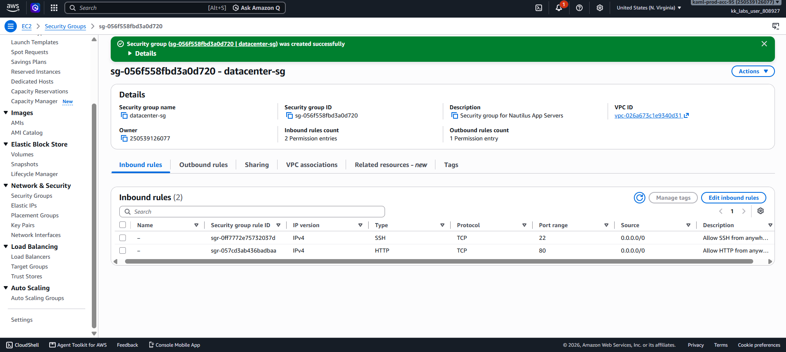

# Day 02 — Create a Security Group in the Default VPC

## 🎯 Objective
Create a security group named `datacenter-sg` in the default VPC with:
- Description: `Security group for Nautilus App Servers`
- Inbound rule: HTTP (port 80) from `0.0.0.0/0`
- Inbound rule: SSH (port 22) from `0.0.0.0/0`

## 🧭 Steps Taken
1. Logged in to the AWS Management Console for the lab account.
2. Confirmed the region was set to **US East (N. Virginia) us-east-1**.
3. Navigated to **EC2 → Network & Security → Security Groups**.
4. Clicked **Create security group**.
5. Configured the basic details:
   - **Security group name**: `datacenter-sg`
   - **Description**: `Security group for Nautilus App Servers`
   - **VPC**: Default VPC (`vpc-026a673c1e9340d31`)
6. Added inbound rule 1:
   - Type: **SSH**
   - Protocol: TCP
   - Port range: **22**
   - Source: **0.0.0.0/0**
7. Added inbound rule 2:
   - Type: **HTTP**
   - Protocol: TCP
   - Port range: **80**
   - Source: **0.0.0.0/0**
8. Left outbound rules as default (All traffic → 0.0.0.0/0).
9. Clicked **Create security group**.
10. Verified the security group appears in the Security Groups list with 2 inbound rules.

## ☁️ AWS Services Used
- **EC2** (Security Groups)
- **VPC** (Default VPC)

## 💡 Key Learnings
- Security groups are **stateful** — return traffic is automatically allowed, regardless of outbound rules.
- A security group must belong to a **VPC**. If not specified, the default VPC is used.
- `0.0.0.0/0` means **any IPv4 address** on the internet. Fine for labs, but **not recommended in production** for SSH.
- Security groups act as **virtual firewalls** at the **instance level**, unlike NACLs which work at the **subnet level**.
- A security group can have multiple inbound and outbound rules.
- Best practice: restrict SSH source to a specific IP range in real environments.

## 🖼️ Screenshot
### Inbound Rules

## 🔗 Reference
- Task provided by: [KodeKloud 100 Days of Cloud](https://kodekloud.com/100-days-of-cloud)
