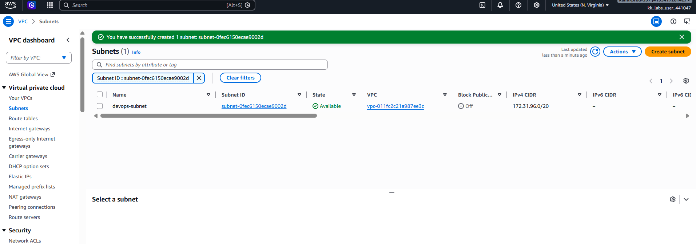

# Day 03 — Create a Subnet in the Default VPC

## 🎯 Objective
Create a subnet named `devops-subnet` under the default VPC in the `us-east-1` region.

## 🧭 Steps Taken
1. Logged in to the AWS Management Console for the lab account.
2. Confirmed the region was set to **US East (N. Virginia) us-east-1**.
3. Opened the **VPC** console and navigated to **Subnets**.
4. Clicked **Create subnet**.
5. Selected the **default VPC** as the parent VPC.
6. Configured the subnet:
   - **Subnet name**: `devops-subnet`
   - **Availability Zone**: Default (e.g., `us-east-1a`)
   - **IPv4 subnet CIDR block**: A free CIDR from the default VPC range (`172.31.0.0/16`)
7. Clicked **Create subnet**.
8. Verified the subnet appears in the Subnets list with state **Available** and attached to the default VPC.

## ☁️ AWS Services Used
- **VPC** (Subnets, Default VPC)

## 💡 Key Learnings
- A **subnet** is a logical subdivision of a VPC's IP address range, tied to a single **Availability Zone**.
- Every subnet must exist inside a VPC and cannot span multiple AZs.
- The **default VPC** in AWS comes pre-configured with a public subnet in each AZ, using the `172.31.0.0/16` address range.
- Subnet CIDRs must fall within the parent VPC's CIDR and must not overlap with existing subnets.
- Subnets are used to organize resources into **public** (internet-facing) vs. **private** (internal) tiers.
- Best practice: place app servers in private subnets and load balancers in public subnets.

## 🖼️ Screenshot

## 🔗 Reference
- Task provided by: [KodeKloud 100 Days of Cloud](https://kodekloud.com/100-days-of-cloud)
