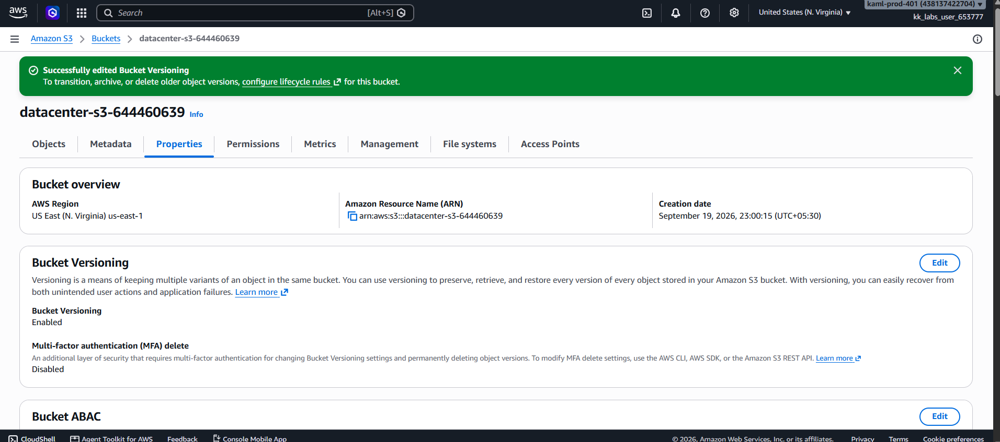

# Day 04 — Enable Versioning on an S3 Bucket

## 🎯 Objective
Enable versioning on the S3 bucket `datacenter-s3-644460639` to support data protection and recovery from accidental deletion or corruption.

## 🧭 Steps Taken
1. Logged in to the AWS Management Console for the lab account.
2. Confirmed the region was set to **US East (N. Virginia) us-east-1**.
3. Opened the **S3** console and navigated to the bucket `datacenter-s3-644460639`.
4. Clicked the **Properties** tab.
5. Scrolled to **Bucket Versioning** and clicked **Edit**.
6. Selected **Enable** and clicked **Save changes**.
7. Verified the status changed to **Enabled**.

## ☁️ AWS Services Used
- **S3** (Bucket Versioning)

## 💡 Key Learnings
- **Versioning** keeps multiple variants of an object in the same bucket, allowing recovery from accidental deletes or overwrites.
- Once enabled, versioning can only be **suspended**, not fully disabled — this protects existing versions.
- Each version gets a unique **Version ID**. A **delete marker** is added when an object is "deleted," but prior versions remain accessible.
- Versioning supports **MFA Delete** for extra protection in production environments.
- Versioning increases storage costs because every version is stored — lifecycle policies help manage old versions.

## 🖼️ Screenshot

## 🔗 Reference
- Task provided by: [KodeKloud 100 Days of Cloud](https://kodekloud.com/100-days-of-cloud)
