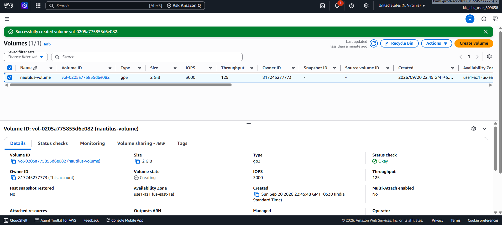

# Day 05 — Create an EBS Volume

## 🎯 Objective
Create an EBS volume named `nautilus-volume` with:
- Volume type: **gp3**
- Size: **2 GiB**
- Region: `us-east-1`

## 🧭 Steps Taken
1. Logged in to the AWS Management Console for the lab account.
2. Confirmed the region was set to **US East (N. Virginia) us-east-1**.
3. Navigated to **EC2 → Elastic Block Store → Volumes**.
4. Clicked **Create volume**.
5. Configured:
   - **Volume type**: `gp3`
   - **Size**: `2 GiB`
   - **Availability Zone**: `us-east-1a`
6. Added a **tag** to name the volume:
   - Key: `Name`
   - Value: `nautilus-volume`
7. Clicked **Create volume**.
8. Verified the volume appears in the Volumes list with state **Available**, type **gp3**, and size **2 GiB**.

## ☁️ AWS Services Used
- **EC2** (Elastic Block Store / EBS Volumes)

## 💡 Key Learnings
- **EBS (Elastic Block Store)** provides persistent block-level storage for EC2 instances.
- **gp3** is the latest general-purpose SSD volume type — it offers a baseline of **3,000 IOPS and 125 MiB/s throughput**, independent of volume size, at a lower cost than gp2.
- Volume **names** in AWS are actually **tags** with the key `Name`. The console displays this tag as the "Name" column.
- Volumes are **AZ-specific** — a volume in `us-east-1a` can only be attached to an EC2 instance in the same AZ.
- A volume can be **resized** later (increase only), and gp3 allows independent tuning of IOPS and throughput.
- EBS volumes are **replicated within their AZ** for durability but are **not** automatically backed up — use snapshots for that.

## 🖼️ Screenshot

## 🔗 Reference
- Task provided by: [KodeKloud 100 Days of Cloud](https://kodekloud.com/100-days-of-cloud)
