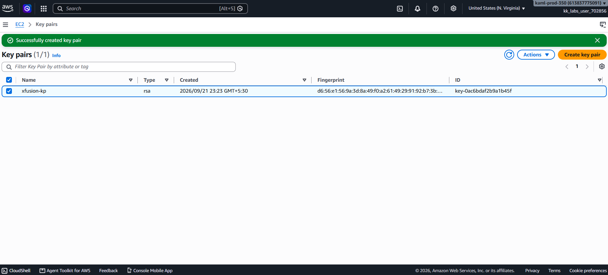
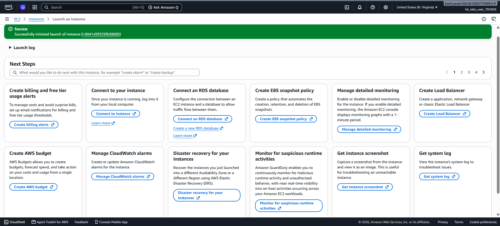
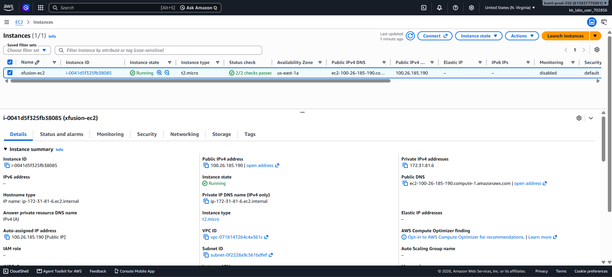

# Day 06 — Launch an EC2 Instance

## 🎯 Objective
Launch an EC2 instance named `xfusion-ec2` with:
- AMI: **Amazon Linux**
- Instance type: **t2.micro**
- Key pair: **`xfusion-kp`** (new RSA key pair)
- Security group: **default**
- Region: `us-east-1`

## 🧭 Steps Taken
1. Logged in to the AWS Management Console for the lab account.
2. Confirmed the region was set to **US East (N. Virginia) us-east-1**.
3. Created a new RSA key pair named `xfusion-kp`:
   - Navigated to **EC2 → Network & Security → Key Pairs**.
   - Clicked **Create key pair**.
   - Configured: Name `xfusion-kp`, Type RSA, Format `.pem`.
   - Downloaded `xfusion-kp.pem`.
4. Navigated to **EC2 → Instances** and clicked **Launch instances**.
5. Configured the instance:
   - **Name**: `xfusion-ec2`
   - **AMI**: Amazon Linux (64-bit x86)
   - **Instance type**: `t2.micro`
   - **Key pair**: `xfusion-kp`
   - **Network**: default VPC, auto-assign public IP enabled
   - **Security group**: `default` (existing)
   - **Storage**: default (8 GiB gp3)
6. Clicked **Launch instance**.
7. Verified the instance shows state **Running** with the correct configuration.

## ☁️ AWS Services Used
- **EC2** (Instances, Key Pairs)
- **VPC** (Default VPC and default security group)

## 💡 Key Learnings
- **EC2 (Elastic Compute Cloud)** provides resizable compute capacity in the cloud.
- **t2.micro** is a burstable instance type that is **Free Tier eligible** (750 hours/month for 12 months).
- **Amazon Linux 2023** is the default AWS-optimized AMI — lightweight, secure, and integrates well with other AWS services.
- A **key pair** is required to SSH into the instance. The private key (`.pem`) can only be downloaded once.
- The **default security group** allows all outbound traffic and only inbound traffic from other instances in the same security group. For SSH access, you'd need to modify its rules.
- **Public IP** assignment is required if you want to access the instance from the internet.
- EC2 instances are **AZ-specific** — you cannot move a running instance between AZs without stopping and re-launching.

## 🖼️ Screenshots

### Key Pair Created

### EC2 Instance Launch Confirmation

### EC2 Instances List

## 🔗 Reference
- Task provided by: [KodeKloud 100 Days of Cloud](https://kodekloud.com/100-days-of-cloud)
