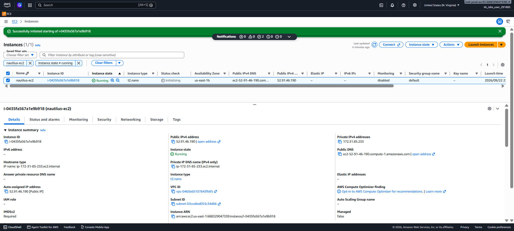

# Day 07 — Change EC2 Instance Type (Rightsizing)

## 🎯 Objective
Change the instance type of `nautilus-ec2` from **t2.micro** to **t2.nano** (rightsizing) and ensure the instance is **Running** afterward.

## 🧭 Steps Taken
1. Logged in to the AWS Management Console for the lab account.
2. Confirmed the region was set to **US East (N. Virginia) us-east-1**.
3. Navigated to **EC2 → Instances** and located `nautilus-ec2`.
4. Verified **Status check** showed **2/2 checks passed** before proceeding.
5. Stopped the instance: **Instance state → Stop instance** → confirmed.
6. Waited until instance state showed **Stopped**.
7. Changed instance type: **Actions → Instance settings → Change instance type** → selected **t2.nano** → applied.
8. Started the instance: **Instance state → Start instance**.
9. Waited until instance state showed **Running**.
10. Verified the instance type now shows **t2.nano**.

## ☁️ AWS Services Used
- **EC2** (Instances, Instance State, Change Instance Type)

## 💡 Key Learnings
- **Rightsizing** is the process of matching instance types to workload needs at the lowest cost — moving from t2.micro to t2.nano reduces cost for underutilized instances.
- You **cannot change instance type while the instance is running** — it must be stopped first.
- **Status checks must pass** before making changes. An instance in "Initializing" state is not ready for modification.
- **Stopping and starting** an instance moves it to new hardware. If using a **non-elastic public IP**, the IP address will change.
- Changing instance type requires **stopping the instance**, which causes brief downtime.
- Verify compatibility between the instance's current configuration (AMI, volumes, networking) and the new instance type before changing.

## 🖼️ Screenshot

## 🔗 Reference
- Task provided by: [KodeKloud 100 Days of Cloud](https://kodekloud.com/100-days-of-cloud)
