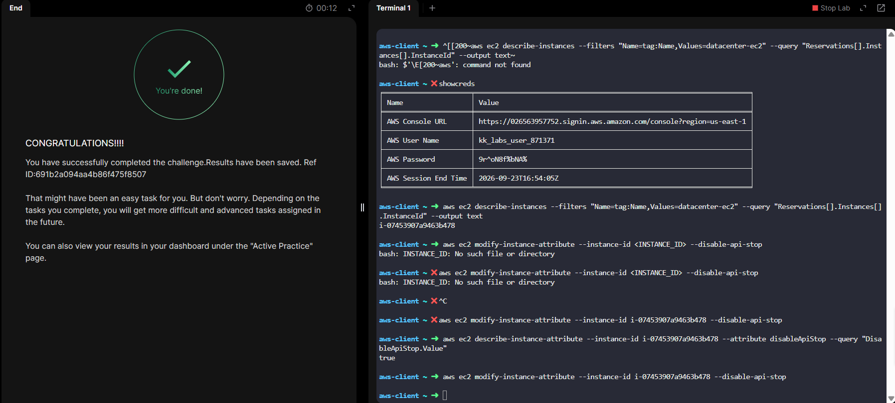

# Day 08 — Enable Stop Protection for an EC2 Instance

## 🎯 Objective
Enable **stop protection** for the EC2 instance `datacenter-ec2` in `us-east-1`, preventing accidental stops that could disrupt running workloads.

## 🧭 Steps Taken
1. Logged in to the AWS Management Console for the lab account.
2. Confirmed the region was set to **US East (N. Virginia) us-east-1**.
3. Navigated to **EC2 → Instances** and located `datacenter-ec2`.
4. Attempted to enable stop protection via the Console:
   - Selected the instance → **Actions → Instance settings → Change stop protection**.
5. The console action did not register correctly with the task checker, so the AWS CLI was used instead:
   - Retrieved the instance ID:
     ```bash
     aws ec2 describe-instances --filters "Name=tag:Name,Values=datacenter-ec2" \
       --query "Reservations[].Instances[].InstanceId" --output text
     ```
     Output: `i-07453907a9463b478`
   - Enabled stop protection:
     ```bash
     aws ec2 modify-instance-attribute \
       --instance-id i-07453907a9463b478 \
       --disable-api-stop
     ```
   - Verified:
     ```bash
     aws ec2 describe-instance-attribute \
       --instance-id i-07453907a9463b478 \
       --attribute disableApiStop \
       --query "DisableApiStop.Value"
     ```
     Output: `true`
6. Confirmed the instance remained in **Running** state with **2/2 checks passed**.

## ☁️ AWS Services Used
- **EC2** (Instance protection, Instance attributes)

## 💡 Key Learnings
- **Stop protection** prevents accidental stops (not terminations) of an EC2 instance. Terminate protection is a separate attribute (`disableApiTermination`).
- Stop protection is set via the `disableApiStop` instance attribute.
- **Console vs CLI discrepancy**: The AWS Console UI sometimes delays or fails to persist attribute changes. When this happens, the AWS CLI is the reliable fallback.
- Enabling stop protection is a **safety measure** for production workloads — it doesn't affect running state or performance.
- `--disable-api-stop` is a **flag** (no value needed). Its presence enables protection; removing it disables protection.
- Best practice: enable both stop and terminate protection on critical instances.

## 🖼️ Screenshot


## 🔗 Reference
- Task provided by: [KodeKloud 100 Days of Cloud](https://kodekloud.com/100-days-of-cloud)
