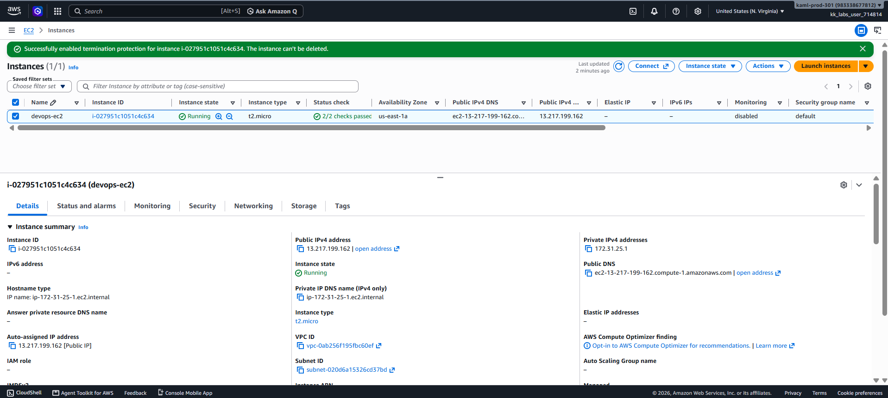

# Day 09 — Enable Termination Protection for an EC2 Instance

## 🎯 Objective
Enable **termination protection** for the EC2 instance `devops-ec2` in `us-east-1`, preventing accidental deletion of a critical production instance.

## 🧭 Steps Taken
1. Logged in to the AWS Management Console for the lab account.
2. Confirmed the region was set to **US East (N. Virginia) us-east-1**.
3. Navigated to **EC2 → Instances** and located `devops-ec2`.
4. Selected the instance checkbox.
5. Clicked **Actions → Instance settings → Change termination protection**.
6. Checked **Enable** in the dialog.
7. Clicked **Save**.
8. Confirmed the success banner: **"Enabled termination protection for i-xxxxxx"**.
9. Verified via AWS CLI:
   ```bash
   aws ec2 describe-instance-attribute \
     --instance-id <INSTANCE_ID> \
     --attribute disableApiTermination \
     --query "DisableApiTermination.Value"
   ```
   Output: **`true`**

## ☁️ AWS Services Used
- **EC2** (Instance protection, Instance attributes)

## 💡 Key Learnings
- **Termination protection** prevents an EC2 instance from being accidentally terminated (deleted). It is set via the `disableApiTermination` attribute.
- **Stop protection** (Day 08) prevents stopping an instance. **Termination protection** (Day 09) prevents deletion — they are two different attributes:
  - `disableApiStop` → prevents stopping
  - `disableApiTermination` → prevents terminating
- Both protections are **instance-level attributes** and can be changed without stopping the instance.
- Enabling termination protection is a **critical safety measure** for production instances — protects against human error and accidental `terraform destroy` or `aws ec2 terminate-instances` commands.
- **AWS CLI is the reliable fallback** when the Console UI fails to persist the attribute (as seen on Day 08).
- `--disable-api-termination` is a **flag** — its presence enables protection; omitting it disables protection.

## 🖼️ Screenshot


## 🔗 Reference
- Task provided by: [KodeKloud 100 Days of Cloud](https://kodekloud.com/100-days-of-cloud)
