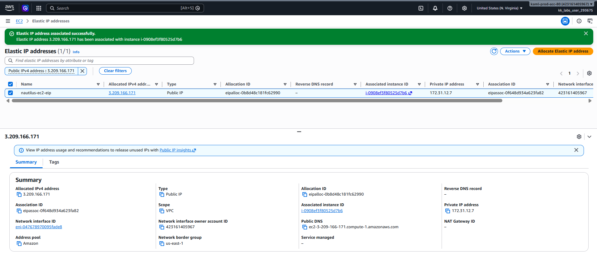

# Day 10 — Attach an Elastic IP to an EC2 Instance

## 🎯 Objective
Associate the Elastic IP address `nautilus-ec2-eip` with the EC2 instance `nautilus-ec2` in `us-east-1`, providing a static public IP that survives instance stop/start cycles.

## 🧭 Steps Taken
1. Logged in to the AWS Management Console for the lab account.
2. Confirmed the region was set to **US East (N. Virginia) us-east-1**.
3. Navigated to **EC2 → Network & Security → Elastic IPs**.
4. Selected the Elastic IP `nautilus-ec2-eip`.
5. Clicked **Actions → Associate Elastic IP address**.
6. Configured the association:
   - **Resource type**: Instance
   - **Instance**: `i-0908ef3f80525d7b6` (`nautilus-ec2`)
   - **Private IP address**: (left default)
   - **Reassociation**: Left unchecked (fresh association)
7. Clicked **Associate**.
8. Confirmed the success banner and verified the association in the Elastic IPs list.

## ☁️ AWS Services Used
- **EC2** (Elastic IPs, Instances)

## 💡 Key Learnings
- An **Elastic IP (EIP)** is a static, public IPv4 address designed for dynamic cloud computing.
- EIPs are **region-specific** and cannot be moved between regions.
- When you associate an EIP with an instance that already has a public IPv4 address, the old public IP is **released back to Amazon's pool** and cannot be reused.
- EIPs survive instance **stop/start** cycles — the public IP stays the same, unlike the default dynamic public IP.
- **You are charged for all EIPs**, whether associated or idle (unattached).
- The default quota is **5 EIPs per region**.
- EIPs are useful for **failover** — you can quickly remap the address to another instance in your account.
- The **Reassociation** checkbox is only needed when moving an EIP from one resource to another.

## 🖼️ Screenshot

## 🔗 Reference
- Task provided by: [KodeKloud 100 Days of Cloud](https://kodekloud.com/100-days-of-cloud)
