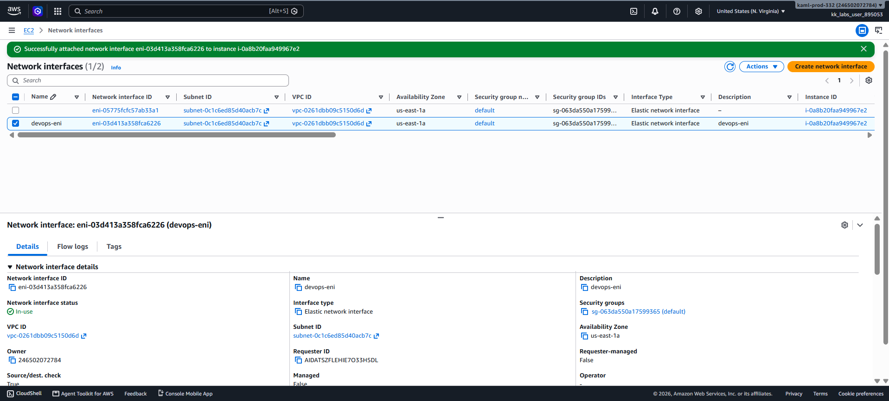

# Day 11 — Attach an Elastic Network Interface (ENI) to an EC2 Instance

## 🎯 Objective
Attach the Elastic Network Interface `devops-eni` to the EC2 instance `devops-ec2` in `us-east-1`, ensuring the interface status is **attached** and the instance initialization is complete.

## 🧭 Steps Taken
1. Logged in to the AWS Management Console for the lab account.
2. Confirmed the region was set to **US East (N. Virginia) us-east-1**.
3. Verified `devops-ec2` was in **Running** state with **2/2 checks passed** (instance initialization complete).
4. Navigated to **EC2 → Network & Security → Network Interfaces**.
5. Selected the ENI `devops-eni` (Status: **Available**).
6. Clicked **Actions → Attach**.
7. Configured the attachment:
   - **Instance**: `devops-ec2`
   - **Device index**: `1` (primary interface uses index 0)
   - **Advanced ENA Configuration**: Left as default (not supported on `t2.micro`)
8. Clicked **Attach**.
9. Confirmed the success banner and verified the status changed to **`in-use`** (attached).

## ☁️ AWS Services Used
- **EC2** (Elastic Network Interfaces, Instances)

## 💡 Key Learnings
- An **Elastic Network Interface (ENI)** is a virtual network card for an EC2 instance.
- An ENI can be attached to an instance in the **same Availability Zone** only.
- The **device index** determines the interface's position: index `0` is the primary interface, `1` is the first secondary interface.
- Attaching a secondary ENI enables **multi-homed instances** — useful for network separation, management traffic, or multi-NIC performance.
- You can attach an ENI while the instance is **running (hot attach)**, **stopped (warm attach)**, or **during launch (cold attach)**.
- The **primary ENI cannot be detached**, but secondary ENIs can be detached and reattached to another instance.
- **ENA (Elastic Network Adapter)** features like ENA Express and ENA queues are advanced networking options that require specific instance types. `t2.micro` does not support them, so they were left disabled.
- For Amazon Linux or Windows instances, a warm/hot attach is automatically configured by the OS.

## 🖼️ Screenshot

## 🔗 Reference
- Task provided by: [KodeKloud 100 Days of Cloud](https://kodekloud.com/100-days-of-cloud)
