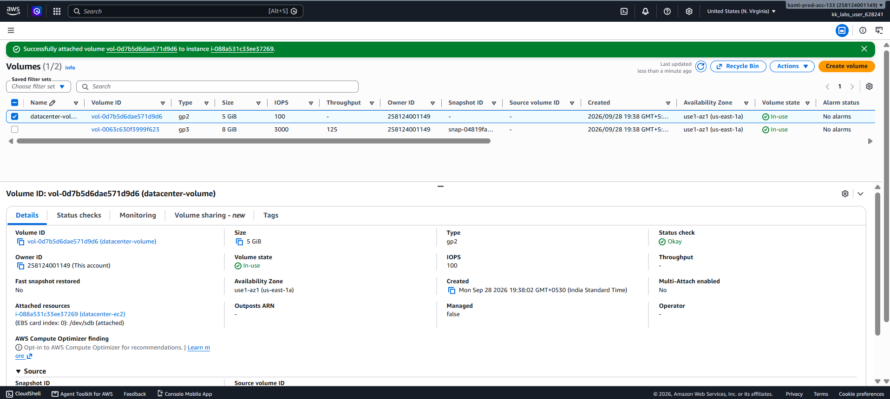

# Day 12 — Attach an EBS Volume to an EC2 Instance

## 🎯 Objective
Attach the existing EBS volume `datacenter-volume` to the EC2 instance `datacenter-ec2` in the `us-east-1` region, specifying the device name as `/dev/sdb`.

## 🧭 Steps Taken
1. Logged in to the AWS Management Console for the lab account.
2. Confirmed the region was set to **US East (N. Virginia) us-east-1**.
3. Verified that `datacenter-ec2` and `datacenter-volume` were in the same Availability Zone.
4. Navigated to **EC2 → Elastic Block Store → Volumes**.
5. Selected the volume `datacenter-volume`.
6. Clicked **Actions → Attach volume**.
7. Configured the attachment:
   - **Instance**: `datacenter-ec2`
   - **Device name**: `/dev/sdb`
8. Clicked **Attach volume** and verified the volume state changed to **`in-use`**.

## ☁️ AWS Services Used
- **EC2** (Elastic Block Store Volumes)

## 💡 Key Learnings
- An EBS volume must be in the **same Availability Zone** as the EC2 instance it is being attached to[citation:1].
- The **device name** is the name used by AWS to expose the volume to the instance (e.g., `/dev/sdb`). The operating system may see a slightly different name (like `/dev/xvdb`), but `/dev/sdb` is the correct value to specify[citation:4].
- The volume state changes from **`available`** to **`in-use`** after a successful attachment.
- EBS volumes provide persistent, detachable block storage for EC2 instances.

## 🖼️ Screenshot

## 🔗 Reference
- Task provided by: [KodeKloud 100 Days of Cloud](https://kodekloud.com/100-days-of-cloud)
