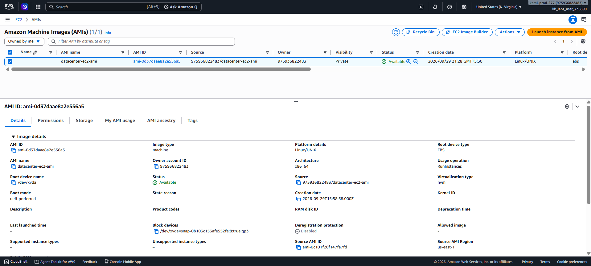
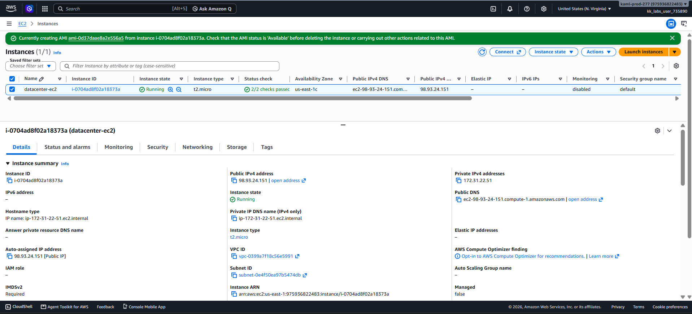

# Day 13 — Create an AMI from an EC2 Instance

## 🎯 Objective
Create an Amazon Machine Image (AMI) named `datacenter-ec2-ami` from the existing EC2 instance `datacenter-ec2`, ensuring the AMI reaches the **available** state.

## 🧭 Steps Taken
1. Logged in to the AWS Management Console for the lab account.
2. Confirmed the region was set to **US East (N. Virginia) us-east-1**.
3. Navigated to **EC2 → Instances** and selected the instance `datacenter-ec2`.
4. Clicked **Actions → Image and templates → Create image**.
5. Configured the image settings:
   - **Image name**: `datacenter-ec2-ami`
   - Left the **Reboot instance** checkbox enabled (default) for file system consistency.
6. Clicked **Create image**.
7. Navigated to **EC2 → AMIs** to monitor the creation progress.
8. Waited until the AMI status changed from **`pending`** to **`available`** before submitting the task.

## ☁️ AWS Services Used
- **EC2** (Amazon Machine Images, Instances)

## 💡 Key Learnings
- An **AMI** is a preconfigured template (a "golden image") used to launch EC2 instances, containing the OS, applications, and configurations.
- Creating an AMI captures a point-in-time snapshot of the instance's EBS volumes.
- The **Reboot instance** option ensures data consistency on the root volume during the snapshot process. If unchecked, file system integrity cannot be guaranteed.
- AMI creation is **asynchronous**; the status starts as `pending` and takes a few minutes to become `available`.
- AMIs are **region-specific**; this AMI is only available in `us-east-1`.

## 🖼️ Screenshots

### 1. AMI Creation Initiated from `datacenter-ec2`

### 2. AMI Reached `Available` State

## 🔗 Reference
- Task provided by: [KodeKloud 100 Days of Cloud](https://kodekloud.com/100-days-of-cloud)
