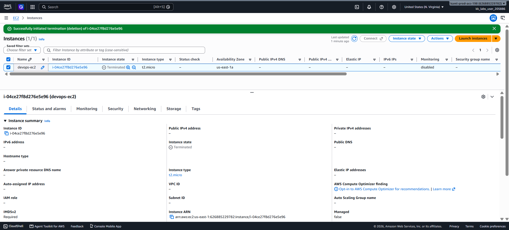

# Day 14 — Terminate an EC2 Instance

## 🎯 Objective
Delete the EC2 instance `devops-ec2` in `us-east-1` and ensure it reaches the **terminated** state before submission.

## 🧭 Steps Taken
1. Logged in to the AWS Management Console for the lab account.
2. Confirmed the region was set to **US East (N. Virginia) us-east-1**.
3. Navigated to **EC2 → Instances** and selected `devops-ec2`.
4. Clicked **Instance state → Terminate instance**.
5. Confirmed the termination.
6. Waited until the instance state changed from `Shutting-down` to **`Terminated`**.

## ☁️ AWS Services Used
- **EC2** (Instance lifecycle management)

## 💡 Key Learnings
- **Termination** permanently deletes an EC2 instance. This is irreversible — the instance cannot be recovered.
- By default, the **root EBS volume is deleted** on termination unless the `DeleteOnTermination` attribute is set to `false`.
- The instance transitions through states: `Running` → `Shutting-down` → `Terminated`.
- A terminated instance remains visible in the console for a short period, then disappears.
- **Termination protection** must be disabled first if it's enabled — otherwise the terminate action will fail.
- Best practice: take an **AMI or snapshot** before terminating an instance if you might need it later.

## 🖼️ Screenshot

### Instance Terminated from `devops-ec2`

## 🔗 Reference
- Task provided by: [KodeKloud 100 Days of Cloud](https://kodekloud.com/100-days-of-cloud)
