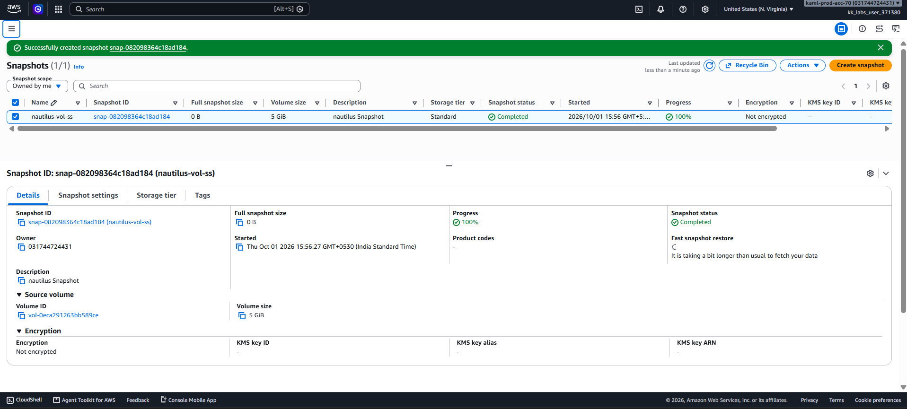

# Day 15 — Create a Snapshot of an EBS Volume

## 🎯 Objective
Create a snapshot of the existing EBS volume `nautilus-vol` in `us-east-1`, named `nautilus-vol-ss`, with description `nautilus Snapshot`, and ensure the snapshot reaches **completed** status.

## 🧭 Steps Taken
1. Logged in to the AWS Management Console for the lab account.
2. Confirmed the region was set to **US East (N. Virginia) us-east-1**.
3. Navigated to **EC2 → Elastic Block Store → Snapshots** and clicked **Create snapshot**.
4. Configured the snapshot:
   - **Resource type**: Volume
   - **Volume ID**: `nautilus-vol`
   - **Description**: `nautilus Snapshot`
   - **Tags**: Key=`Name`, Value=`nautilus-vol-ss`
5. Clicked **Create snapshot**.
6. Waited until the snapshot status changed from `pending` to **`completed`** before submitting.

## ☁️ AWS Services Used
- **EC2** (EBS Snapshots)

## 💡 Key Learnings
- An **EBS snapshot** is a point-in-time backup of an EBS volume, stored incrementally in S3.
- Snapshots are **region-specific** and are automatically created in the same region as the source volume [citation:3].
- The **Name tag** with uppercase `N` is important for KodeKloud checkers — lowercase `name` will fail [citation:9].
- Snapshot creation is **asynchronous**: status starts as `pending` and transitions to **`completed`** when ready [citation:8].
- Only the first snapshot of a volume is a full copy; subsequent snapshots are **incremental**, saving storage cost.
- Snapshots can be used to create new volumes, restore data, or copy across regions.

## 🖼️ Screenshot

### Create Volume Snapshot

## 🔗 Reference
- Task provided by: [KodeKloud 100 Days of Cloud](https://kodekloud.com/100-days-of-cloud)
