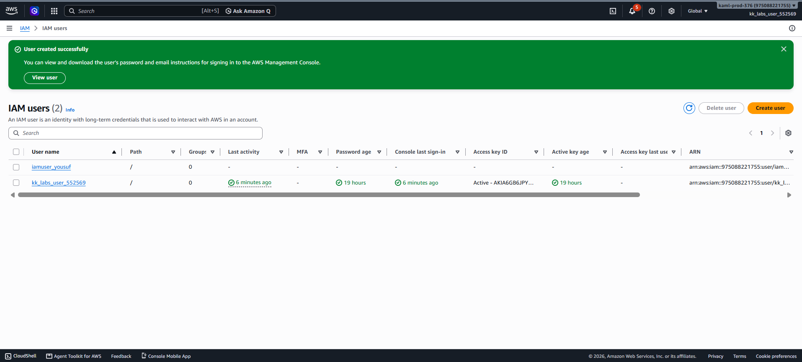

# Day 16 — Create an IAM User

## 🎯 Objective
Create an IAM user named `iamuser_yousuf` in the AWS account.

## 🧭 Steps Taken
1. Logged in to the AWS Management Console for the lab account.
2. Confirmed the region was set to **US East (N. Virginia) us-east-1**.
3. Navigated to **IAM → Users**.
4. Clicked **Create user**.
5. Entered the user name: `iamuser_yousuf`.
6. Left console access unchecked (not required for this task).
7. Left permissions as default (no policies attached — task only asked for user creation).
8. Clicked **Create user**.
9. Verified the user appears in the IAM Users list.

## ☁️ AWS Services Used
- **IAM** (Identity and Access Management)

## 💡 Key Learnings
- **IAM (Identity and Access Management)** is the foundation of AWS security — it controls who can access what resources and what actions they can perform.
- An **IAM user** is an identity within an AWS account with specific permissions for a person or application.
- Creating a user without permissions means the user can authenticate but cannot do anything — permissions must be explicitly attached via policies or groups.
- IAM is a **global service** — users are not region-specific, but the console region affects where resources are created.
- **Security best practice**: Use IAM Identity Center or federation with temporary credentials instead of long-term IAM users for human access. IAM users are best for specific workloads or emergency access.
- **Least privilege principle**: Always grant only the minimum permissions a user needs.
- IAM is **eventually consistent** — changes may take a short time to propagate.

## 🖼️ Screenshot

### IAM User Created

## 🔗 Reference
- Task provided by: [KodeKloud 100 Days of Cloud](https://kodekloud.com/100-days-of-cloud)
