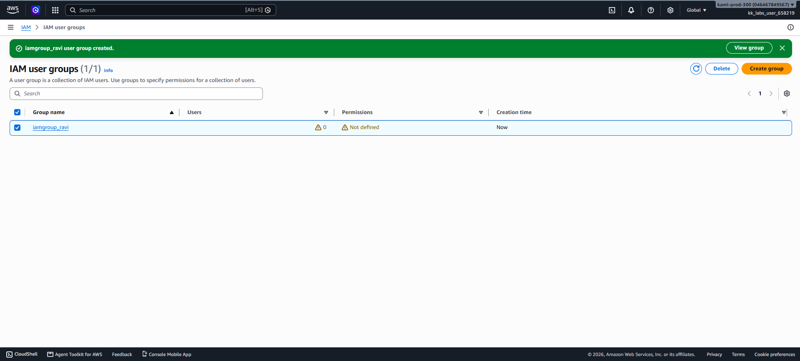

# Day 17 — Create an IAM Group

## 🎯 Objective
Create an IAM group named `iamgroup_ravi` in the AWS account.

## 🧭 Steps Taken
1. Logged in to the AWS Management Console for the lab account.
2. Confirmed the region was set to **US East (N. Virginia) us-east-1**.
3. Navigated to **IAM → User groups**.
4. Clicked **Create group**.
5. Entered the group name: `iamgroup_ravi`.
6. Skipped adding users (not required).
7. Skipped attaching permissions policies (not required).
8. Clicked **Create group**.
9. Verified the group appears in the IAM User groups list.

## ☁️ AWS Services Used
- **IAM** (Identity and Access Management)

## 💡 Key Learnings
- An **IAM group** is a collection of IAM users. Groups let you specify permissions for multiple users at once, making permissions management easier.
- **Best practice**: Assign permissions to groups, not individual users. This simplifies access management and enforces consistency.
- Users can belong to **multiple groups** and inherit permissions from all of them.
- Groups **cannot be nested** — you cannot put one group inside another.
- A group is **not an identity** — it cannot be referenced as a Principal in a resource-based policy. Only users and roles can be Principals.
- IAM groups are **global** — they exist across all AWS regions.
- **Least privilege principle**: Always grant only the minimum permissions a group needs.

## 🖼️ Screenshot

### IMA Group Created

## 🔗 Reference
- Task provided by: [KodeKloud 100 Days of Cloud](https://kodekloud.com/100-days-of-cloud)
