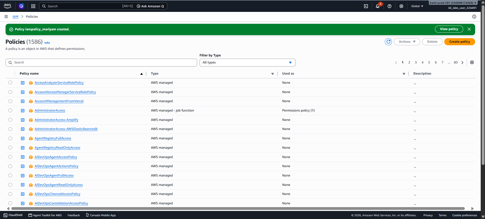

# Day 18 — Create a Custom IAM Policy for Read-Only EC2 Console Access

## 🎯 Objective
Create an IAM policy named `iampolicy_mariyam` that grants read-only access to the EC2 console, allowing users to view all instances, AMIs, and snapshots.

## 🧭 Steps Taken
1. Logged in to the AWS Management Console for the lab account.
2. Confirmed the region was set to **US East (N. Virginia) us-east-1**.
3. Navigated to **IAM → Policies**.
4. Clicked **Create policy**.
5. Switched to the **JSON** tab.
6. Pasted the policy document with `ec2:Describe*` action.
7. Clicked **Next**.
8. Entered the policy name: `iampolicy_mariyam`.
9. Clicked **Create policy**.
10. Verified the policy appears in the IAM Policies list.

## ☁️ AWS Services Used
- **IAM** (Identity and Access Management)

## 💡 Key Learnings
- **`ec2:Describe*`** is a wildcard action that grants read-only access to all EC2 `Describe` API calls, including instances, AMIs, and snapshots.
- IAM policies are JSON documents with three core elements: **Effect** (Allow/Deny), **Action** (what API calls), and **Resource** (which AWS resources).
- **Least privilege principle**: Grant only the permissions needed. `ec2:Describe*` is perfect for read-only console access because `Describe` actions cannot modify resources.
- **Resource-level permissions**: EC2 `Describe*` actions do not support resource-level restrictions, so `Resource: "*"` is required.
- The **AmazonEC2ReadOnlyAccess** managed policy uses the same `ec2:Describe*` pattern for read-only access.
- IAM policies are **global** — they exist across all AWS regions.
- Best practice: Create **customer-managed policies** for specific use cases rather than attaching broad managed policies.

## 🖼️ Screenshot

### IAM Policy Created

## 🔗 Reference
- Task provided by: [KodeKloud 100 Days of Cloud](https://kodekloud.com/100-days-of-cloud)
