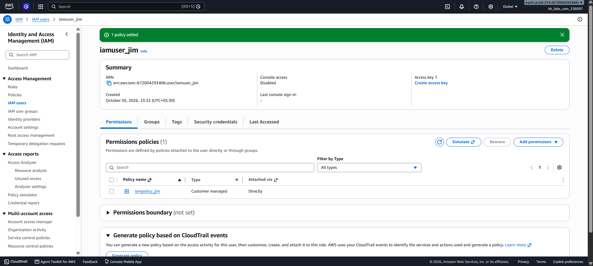

# Day 19 — Attach IAM Policy to an IAM User

## 🎯 Objective
Attach the existing IAM policy `iampolicy_jim` to the IAM user `iamuser_jim`.

## 🧭 Steps Taken
1. Logged in to the AWS Management Console for the lab account.
2. Navigated to **IAM → Users** and selected `iamuser_jim`.
3. Clicked the **Permissions** tab and then **Add permissions → Attach policies directly**.
4. Searched for `iampolicy_jim` and selected it.
5. Clicked **Next** and then **Add permissions** to confirm.
6. Verified the policy appeared under the user's "Permissions policies."

## ☁️ AWS Services Used
- **IAM** (Identity and Access Management)

## 💡 Key Learnings
- An IAM policy is a static document until it is **attached** to an identity (user, group, or role). Only then does it grant permissions.
- **Managed policies** (like `iampolicy_jim`) are reusable and easier to track than inline policies.
- Permissions take effect **immediately** after attachment — no need for the user to log out and back in.
- **Best practice**: Attach policies to **groups** instead of individual users for easier management at scale.
- If two policies conflict (one allows, one denies), **Deny always wins**.
- IAM is a **global service**, but the console region still affects where you see resources.

## 🖼️ Screenshot

### Policy Attached to User

## 🔗 Reference
- Task provided by: [KodeKloud 100 Days of Cloud](https://kodekloud.com/100-days-of-cloud)
