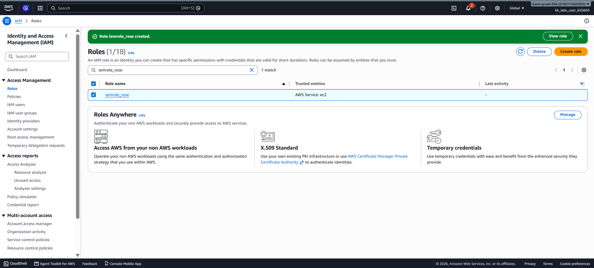

# Day 20 — Create an IAM Role for EC2

## 🎯 Objective
Create an IAM role named `iamrole_rose` with the AWS Service (EC2) use case and attach the policy `iampolicy_rose`.

## 🧭 Steps Taken
1. Logged in to the AWS Management Console for the lab account.
2. Navigated to **IAM → Roles** and clicked **Create role**.
3. Selected **AWS Service** as the trusted entity type and **EC2** as the use case.
4. Searched for and selected the policy `iampolicy_rose`.
5. Named the role `iamrole_rose` and clicked **Create role**.
6. Verified the role appears in the IAM Roles list with the correct policy attached.

## ☁️ AWS Services Used
- **IAM** (Roles, Policies)

## 💡 Key Learnings
- An **IAM Role** provides temporary security credentials for AWS services (like EC2) to access other AWS resources.
- The **Trust Policy** defines which entity (e.g., `ec2.amazonaws.com`) is allowed to assume the role.
- Roles are more secure than IAM users for services because there are no long-term access keys to manage or rotate.
- When creating a role for EC2 via the Console, AWS automatically creates an **Instance Profile** with the same name as the role.

## 🖼️ Screenshot

### IAM Role Created

## 🔗 Reference
- Task provided by: [KodeKloud 100 Days of Cloud](https://kodekloud.com/100-days-of-cloud)
