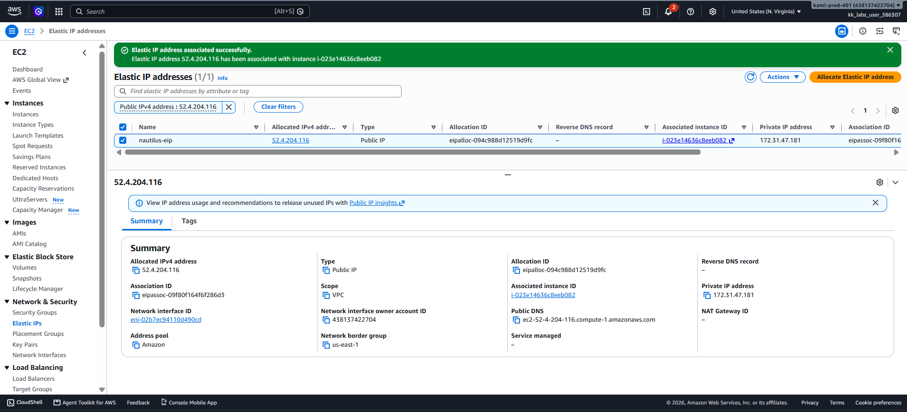

# Day 21 — Launch EC2 Instance and Associate Elastic IP

## 🎯 Objective
Create an EC2 instance named `nautilus-ec2` using a Linux AMI (t2.micro) and associate an Elastic IP named `nautilus-eip` to it.

## 🧭 Steps Taken
1. Logged in to the AWS Management Console and confirmed the region was `us-east-1`.
2. Navigated to **EC2 → Instances → Launch instances**.
3. Configured the instance:
   - **Name**: `nautilus-ec2`
   - **AMI**: Ubuntu (Free tier eligible)
   - **Instance type**: `t2.micro`
   - **Key pair**: Proceeded without a key pair.
   - **Network**: Default VPC and default security group.
4. Launched the instance and waited until state was `Running` with `2/2` status checks passed.
5. Navigated to **EC2 → Network & Security → Elastic IPs** and clicked **Allocate Elastic IP address**.
6. **Added the Name tag during allocation**: Key=`Name`, Value=`nautilus-eip`.
7. Allocated the IP — it appeared in the list with the correct name.
8. Selected `nautilus-eip`, clicked **Actions → Associate Elastic IP address**.
9. Chose `nautilus-ec2` as the target instance and clicked **Associate**.
10. Verified the association in the Elastic IPs list.

## ☁️ AWS Services Used
- **EC2** (Instances, Elastic IPs)

## 💡 Key Learnings
- **Elastic IPs (EIP)** provide a static public IPv4 address that survives instance stop/start cycles.
- The instance must be in a **public subnet** with an Internet Gateway for the EIP to be reachable.
- An EIP can only be associated with **one instance** at a time.
- If you associate an EIP with an instance that already has a dynamic public IP, the dynamic IP is released back to the AWS pool.
- EIPs are billed whether they are associated or idle.
- **Best practice learned the hard way**: The `Name` tag must be added **during allocation** — adding it after does not always register correctly with validation checks.

## 🖼️ Screenshot

### Elastic IP Associated with EC2

## 🔗 Reference
- Task provided by: [KodeKloud 100 Days of Cloud](https://kodekloud.com/100-days-of-cloud)
