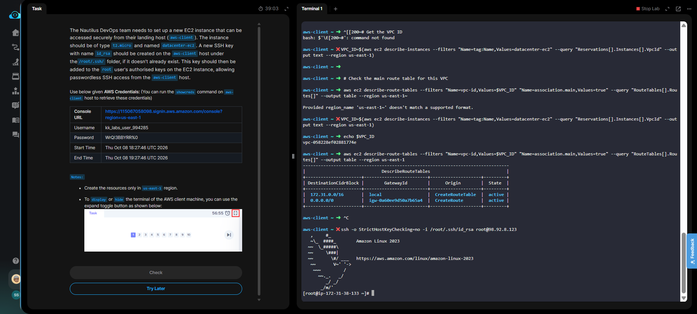

# Day 22 — Configure Passwordless SSH Access for Root

## 🎯 Objective
Set up an EC2 instance (`datacenter-ec2`, t2.micro) and configure passwordless SSH access for the **root** user from the `aws-client` landing host.

## 🧭 Steps Taken
1. Generated an RSA SSH key pair on the `aws-client` host at `/root/.ssh/id_rsa` using `ssh-keygen`.
2. Imported the public key to AWS as `datacenter-key` using `aws ec2 import-key-pair`.
3. Launched a `t2.micro` Amazon Linux 2023 instance via AWS CLI and tagged it `datacenter-ec2`.
4. Allowed SSH traffic (port 22) in the security group.
5. Connected to the instance as `ec2-user` using the imported key.
6. **Emptied** the root user's `authorized_keys` file first to remove default blocking content.
7. Copied `ec2-user`'s `authorized_keys` into `/root/.ssh/authorized_keys`.
8. Set correct permissions (`chmod 700` on `.ssh`, `chmod 600` on `authorized_keys`).
9. Tested direct root SSH from `aws-client` — successful.

## ☁️ AWS Services Used
- **EC2** (Instances, Key Pairs, Security Groups)

## 💡 Key Learnings
- **Root SSH is blocked by default** on Amazon Linux instances. The `/root/.ssh/authorized_keys` file must be explicitly configured.
- **Emptying the file first (`> /root/.ssh/authorized_keys`) is critical** — the default content contains restrictions that block root login.
- Copying `ec2-user`'s `authorized_keys` into root's directory is a fast, reliable way to enable root access.
- **Public IPs change** when instances are stopped/started or re-launched — always re-check the IP before SSH.
- Security groups must allow inbound port 22 for SSH to work.

## 🧾 Commands Used

```bash
# Generate SSH key on aws-client
ssh-keygen -t rsa -b 4096 -f /root/.ssh/id_rsa -N ""

# Import public key to AWS
aws ec2 import-key-pair --key-name "datacenter-key" \
  --public-key-material fileb:///root/.ssh/id_rsa.pub --region us-east-1

# Get latest Amazon Linux 2023 AMI
AMI_ID=$(aws ssm get-parameters \
  --names /aws/service/ami-amazon-linux-latest/al2023-ami-kernel-default-x86_64 \
  --query "Parameters[0].Value" --output text --region us-east-1)

# Launch instance
INSTANCE_ID=$(aws ec2 run-instances --image-id $AMI_ID \
  --instance-type t2.micro --key-name "datacenter-key" \
  --query "Instances[0].InstanceId" --output text --region us-east-1)

# Tag it
aws ec2 create-tags --resources $INSTANCE_ID \
  --tags Key=Name,Value=datacenter-ec2 --region us-east-1

# On the instance (as ec2-user):
sudo -i
> /root/.ssh/authorized_keys
cat /home/ec2-user/.ssh/authorized_keys >> /root/.ssh/authorized_keys
chmod 700 /root/.ssh
chmod 600 /root/.ssh/authorized_keys
exit; exit

# Test root login from aws-client
ssh -o StrictHostKeyChecking=no -i /root/.ssh/id_rsa root@<PUBLIC_IP>
```

## 🖼️ Screenshot

### Root SSH Access Successful



## 🔗 Reference
- Task provided by: [KodeKloud 100 Days of Cloud](https://kodekloud.com/100-days-of-cloud)
