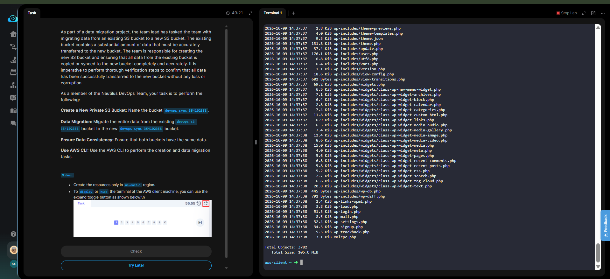

# Day 23 — S3 Bucket Data Migration via AWS CLI

## 🎯 Objective
Create a new private S3 bucket (`devops-sync-354102358`) and migrate all data from the existing `devops-s3-354102358` bucket, ensuring complete data consistency using the AWS CLI.

## 🧭 Steps Taken
1. Created the new destination bucket using `aws s3 mb`.
2. Verified the new bucket was private (S3 default).
3. Migrated all objects using the `aws s3 sync` command, which recursively copies missing or updated files.
4. Verified data integrity by listing the contents of both source and destination buckets with `aws s3 ls --recursive --summarize`.
5. Confirmed that **Total Objects** and **Total Size** matched in both buckets.

## ☁️ AWS Services Used
- **S3** (Simple Storage Service)

## 💡 Key Learnings
- **`aws s3 sync` vs `aws s3 cp`**: `sync` is smarter for migrations because it only copies new or changed files, making it idempotent and efficient for large datasets.
- **Verification is mandatory**: A migration is only complete when you prove the data is consistent. Using `ls --recursive --summarize` gives you concrete object counts and total sizes to compare.
- **Private by default**: New S3 buckets have all public access blocked by default, satisfying the "private" requirement without extra configuration.

## 🧾 Commands Used

```bash
# Create the destination bucket
aws s3 mb s3://devops-sync-354102358 --region us-east-1

# Migrate data
aws s3 sync s3://devops-s3-354102358 s3://devops-sync-354102358

# Verify source
aws s3 ls s3://devops-s3-354102358 --recursive --human-readable --summarize

# Verify destination
aws s3 ls s3://devops-sync-354102358 --recursive --human-readable --summarize
```

## 🖼️ Screenshot

### S3 Migration Verification


## 🔗 Reference
- Task provided by: [KodeKloud 100 Days of Cloud](https://kodekloud.com/100-days-of-cloud)
