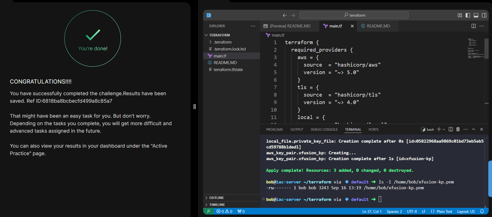

# Terraform Level 1

Hands-on Terraform tasks completed as part of my DevOps/Cloud learning path.

## 📊 Progress

| # | Task | Status |
|---|------|--------|
| 1 | Create RSA key pair `xfusion-kp` in AWS | ✅ |
| 2 | *Coming soon* | ⬜ |
| 3 | *Coming soon* | ⬜ |

---

## Task 1 — Create an RSA Key Pair in AWS using Terraform

### 🎯 Objective
Use Terraform to:
- Generate a new **RSA private key**
- Create an **AWS EC2 key pair** named `xfusion-kp`
- Save the private key locally at `/home/bob/xfusion-kp.pem` with secure permissions (`0600`)

### 🧭 Steps Taken
1. Opened the terminal in VS Code (working directory: `/home/bob/terraform`).
2. Created `main.tf` with:
   - `terraform` block with required providers (aws, tls, local)
   - `provider "aws"` with region `us-east-1`
   - `tls_private_key` resource to generate an RSA 4096-bit key
   - `aws_key_pair` resource to upload the public key to AWS
   - `local_file` resource to save the private key locally with `0600` permissions
3. Removed the pre-existing `provider.tf` to comply with the requirement of using only `main.tf`.
4. Cleaned partial init state: `.terraform/` and `.terraform.lock.hcl`.
5. Ran `terraform init` to download the AWS, TLS, and Local providers.
6. Ran `terraform apply` and confirmed with `yes`.
7. Verified:
   - The AWS key pair `xfusion-kp` exists.
   - The private key file `/home/bob/xfusion-kp.pem` exists with correct permissions.

### 🛠️ Tools Used
- Terraform CLI (v1.5+)
- AWS Provider (`~> 5.0`)
- TLS Provider (`~> 4.0`)
- Local Provider (`~> 2.0`)

### 📄 Terraform Configuration (`main.tf`)

```hcl
terraform {
  required_providers {
    aws = {
      source  = "hashicorp/aws"
      version = "~> 5.0"
    }
    tls = {
      source  = "hashicorp/tls"
      version = "~> 4.0"
    }
    local = {
      source  = "hashicorp/local"
      version = "~> 2.0"
    }
  }
}

provider "aws" {
  region = "us-east-1"
}

# 1. Generate RSA private key
resource "tls_private_key" "xfusion_key" {
  algorithm = "RSA"
  rsa_bits  = 4096
}

# 2. Create AWS key pair
resource "aws_key_pair" "xfusion_kp" {
  key_name   = "xfusion-kp"
  public_key = tls_private_key.xfusion_key.public_key_openssh
}

# 3. Save private key locally
resource "local_file" "private_key_file" {
  content         = tls_private_key.xfusion_key.private_key_pem
  filename        = "/home/bob/xfusion-kp.pem"
  file_permission = "0600"
}
```

### 🧾 Commands Used

```bash
cd /home/bob/terraform
rm -f provider.tf
rm -rf .terraform .terraform.lock.hcl
terraform init
terraform apply
# Type 'yes' at the prompt
```

### 🔍 Verification

```bash
# Check the key pair in AWS
aws ec2 describe-key-pairs --key-names xfusion-kp --query 'KeyPairs[0].KeyName' --output text
# Output: xfusion-kp

# Check the private key file locally
ls -l /home/bob/xfusion-kp.pem
# Output: -rw------- 1 bob bob ... /home/bob/xfusion-kp.pem
```

### 💡 Key Learnings
- **Terraform `tls_private_key`** can generate RSA keys entirely in Terraform — no manual key creation needed.
- **`aws_key_pair`** uploads only the public key to AWS; the private key stays local.
- **`local_file`** resource saves the private key with correct permissions (`0600`) automatically.
- Providers must be declared in the `required_providers` block to pin versions.
- **Only one `.tf` file** is allowed per task when specified — always check the requirements.
- Terraform reads all `.tf` files in the working directory — you never "run" a `.tf` file directly.
- Always run `terraform init` after adding new providers, and `terraform apply` to execute.

### 🖼️ Screenshot


## 🔗 Reference
- Task provided by: [KodeKloud 100 Days of Cloud / Terraform](https://kodekloud.com)
